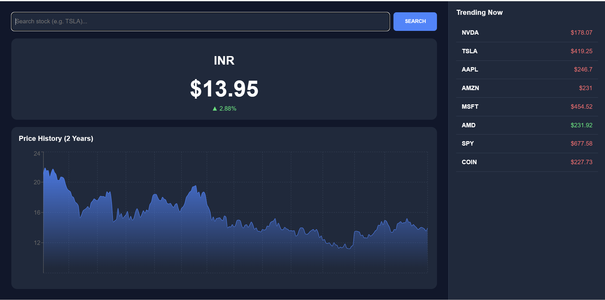

# 📈 LiveFinance


**LiveFinance** is a real-time financial analytics dashboard that combines live market data with AI-powered price predictions. It is containerized and built for high-concurrency data streaming.

---

## 🛠️ Tech Stack

| Component | Technology |
| :--- | :--- |
| **Backend** | Python, FastAPI, Uvicorn |
| **Protocols** | **WebSockets (Real-time)**, **REST API** |
| **Frontend** | React, Vite, Tailwind CSS, Chart.js |
| **AI & ML** | Facebook Prophet, Pandas, NumPy |
| **Data APIs** | **Yahoo Finance (`yfinance`)**, **Finnhub** |
| **DevOps** | Docker, Docker Compose |

---

## 🚀 Key Features

* **⚡ Real-Time Streaming:** Sub-second stock price updates via **WebSockets**.
* **🤖 AI Forecasting:** Generates 7-day price trend predictions using the Prophet ML model.
* **📊 Interactive Charts:** Dynamic, zoomable financial charts for historical analysis.
* **🐳 Dockerized:** One-command setup for the entire full-stack application.

---

## 📸 Dashboard Preview



---

## 🏃‍♂️ Getting Started

Run the entire application locally using Docker Compose.

```bash
# 1. Clone the repo
git clone [https://github.com/ANKRITIS/LiveFinance.git](https://github.com/ANKRITIS/LiveFinance.git)

# 2. Start services
docker-compose up --build
